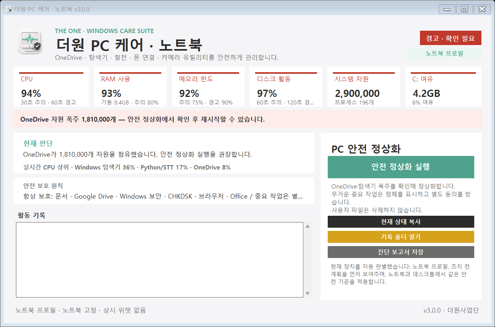

# 더원 PC 케어 Universal

노트북과 데스크톱을 자동 판별하고, 사용자 파일을 삭제하지 않으면서 Windows 자원 폭주를 진단·정상화하는 단일 실행형 도구입니다.



## 다운로드

[최신 릴리스에서 실행파일 내려받기](https://github.com/meta-theone/theone-pc-care/releases/latest)

- `TheOne-PC-Care-Laptop-v3.0.0.exe`: 노트북 프로필 고정
- `TheOne-PC-Care-Desktop-v3.0.0.exe`: 데스크톱 프로필 고정
- `TheOne-PC-Care-Auto-v3.0.0.exe`: 장치 유형 자동 판별

GitHub 호환성을 위해 릴리스 자산은 영문 파일명을 사용합니다. OneDrive 공용 폴더에는 같은 파일을 알아보기 쉬운 한글 이름으로 보관합니다.

설치 과정이 없는 단일 EXE입니다. 처음 실행할 때 Windows SmartScreen이 표시되면 파일 해시와 릴리스 출처를 확인한 뒤 실행하십시오.

## 주요 기능

- CPU·RAM·메모리 커밋·디스크·시스템 핸들·C 드라이브 여유 실시간 표시
- 실시간 CPU 상위 프로세스 3개 표시
- OneDrive 핸들 폭주 시에만 안전 재시작
- Windows 탐색기 핸들·스레드 폭주 시 작업표시줄 자동 복구와 함께 재시작
- Everything 사용 PC에서 Windows 검색색인 일시정지
- RICOH 자동관리 서비스가 설치된 PC에서 관리 모듈만 일시정지
- Robocopy·확인되지 않은 Python 작업은 종료하지 않고 우선순위만 낮춤
- 중요 작업은 정체를 표시하고 별도 동의를 받은 경우에만 일시중지
- 진단 보고서 저장 및 실행 기록 제공

## 안전 원칙

- 사용자 파일, 다운로드, 휴지통, 임시파일을 삭제하지 않습니다.
- 문서, Google Drive, Windows 보안, 금융 보안, 브라우저, Office, CHKDSK를 자동 종료하지 않습니다.
- 일반 상태에서는 아무것도 강제 종료하지 않습니다. OneDrive와 탐색기는 명시된 임계값을 넘을 때만 재시작합니다.
- 관리자 권한은 서비스 일시정지 등 필요한 단계에서만 별도로 요청합니다.
- 네트워크 전송, 광고, 원격제어, 사용정보 수집 기능이 없습니다.

자세한 기준은 [안전 정책](docs/안전정책.md)을 참고하십시오.

## 직접 빌드

Windows 10/11과 .NET Framework 4가 필요합니다.

```powershell
powershell.exe -NoProfile -ExecutionPolicy Bypass -File .\build.ps1
```

빌드 결과는 `dist`에, 자체진단·조치계획·대시보드 검증 결과는 `검증`에 생성됩니다.

## 로그 위치

```text
%LOCALAPPDATA%\TheOne\PCCareUniversal
```

## 라이선스

MIT License
